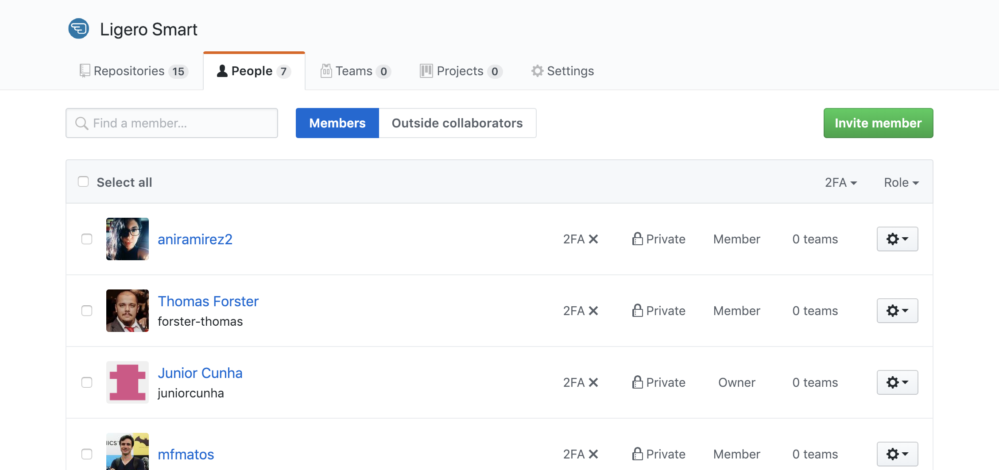

# 02 - Manual do Atendente 

### Apresentação

A seguir descrevemos uma forma de operar este sistema. Trata-se apenas de uma sugestão de uso em relação a fucionalidades. O que nós da Complemento propomos, no entanto, é que a partir da livre experimentação de uso da ferramenta, sua equipe apropie-se e crie seu próprio "jeito de usar", aproveitando assim todo o potencial criativo que sua equipe pode ter em relação ao Ligero;

### Fazendo login

A interface de atendente é acessada através do link:    [http://IP_DO_SERVIDOR/ligero/index.pl](http://IP_DO_SERVIDOR/ligero/index.pl)

Através deste link, será exibida uma tela onde o atendente deverá inserir o seu login e senha e clicar no botão "login".

