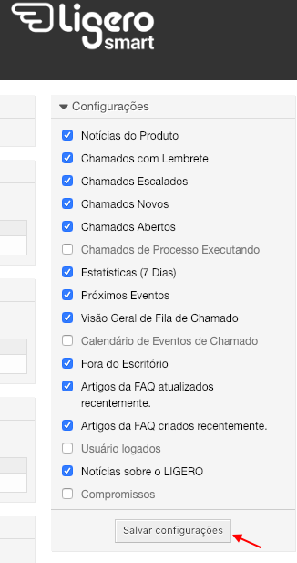
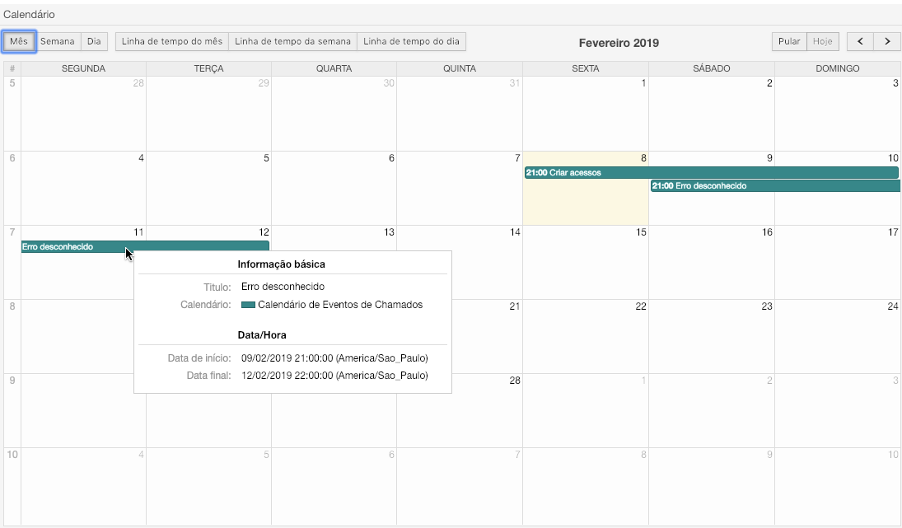

## Apresentação

A seguir descrevemos uma forma de operar este sistema. Trata-se apenas de uma sugestão de uso em relação a fucionalidades. O que nós da Complemento propomos, no entanto, é que a partir da livre experimentação de uso da ferramenta, sua equipe apropie-se e crie seu próprio "jeito de usar", aproveitando assim todo o potencial criativo que sua equipe pode ter em relação ao Ligero;

## Fazendo login

A interface de atendente é acessada através do link:    [http://IP_DO_SERVIDOR/ligero/index.pl](http://IP_DO_SERVIDOR/ligero/index.pl)

Através deste link, será exibida uma tela onde o atendente deverá inserir o seu login e senha e clicar no botão "login".

## Conhecendo a interface de atendimento

### Painel de Controle 

No memonto em que o atendente realiza o login no sistema, ele verá o Painel de Controle como página inicial:

Essa é a área onde o atendente tem a visão geral dos chamados e de suas atividades. Ela é composta por várias Widgets que podem ser habilitadas ou desabilitadas através do menu "Configurações" apontado na imagem anterior.

Veremos a seguir, as widgets padrão do OTRS.

#### Widgets de Listagem de Chamados 

__Chamados Novos:__ Chamados criados por e-mail ou pela interface de cliente que ainda não tiveram interação do atendente.

__Chamados Abertos:__ Chamados em andamento, ou seja, que já tiveram algum tipo de interação do atendente.

__Chamados com Lembrete:__ Nesta caixa aparecerá os chamados que atigirem a "data de pendência" especificada.

__Chamados Escalados:__ Chamados que já tiveram seu prazo de solução, atualização ou resposta excedidas.

__Chamados de Processos Executados:__ Chamados de processo em execução. Esta Widget mostra a etapa atual em que se encontra o chamado.

Podemos configurar cada uma destas caixas passando o mouse em cima da barra de título, clicando na engrenagem, e adicionando campos que acreditamos ser pertinentes para o nosso atendimento.

#### Widgets Adicionais 

__Visão geral de fila de chamado:__ Visualização de todos os chamados nas filas os quais o atendente tem permissão de leitura.

__Próximos eventos:__ Um widget que informa quais são os próximos chamados que irão escalar ou atingirão seu empo de lembrete.

__Calendário de eventos de chamados:__ Nesta caixa, é possível efetuar e visualizar o agendamento do atendimento do chamado;

__Estatística:__ Um *dashboard* que mostra a quantidade de chamados criados e fechados nos últimos 7 dias;

__Online:__ Exibe atendentes e clientes que se encontram logados no sistema

## Chamados 

Neste menu o atendente tem acesso à diferentes visualizações dos chamados bem como criar novos chamados. Os principais submenus estão descritos abaixo.

## Visão de Filas 

Aqui o atendente tem a visualização de todas as filas para as quais ele presta atendimento ou onde possui permissão de visualizaçào para consulta.

__Informações importantes:__

* O número entre parênteses indica a quantidade de chamados disponíveis naquela fila.  
* O link "Minhas Filas"mostra os chamados de todas as filas selecionadas pelo usuário no menu "Alterar Preferências Pessoais" (ver )  
* O link "Chamados disponíveis: X" que vem selecionado por padrão, mostra apenas aqueles chamados não bloqueados que estão na fila selecionada. X é o número de chaamados nesta situação.  
* O link "Todos os chamados: X" mostra além dos chamados disponíveis, todos os chamados ainda não encerrados desta fila, bloqueados (por você ou por outro atendente) e não bloqueados.  
* Os botões (link) S, M e L, situados a direita da tela, nos permitem escolher diferentes visualizações dos tickets desta fila. S (Small) nos mostra uma listagem mais resumida, com mais chamados por página. M (Medium) nos traz a visualização padrão,com algumas ações a partir da tela de listagem dos chamado.  
* Na visualização S (Small), podemos ordenar oschamados de diferentes maneiras, clicando no nome de uma das colunas disponíveis. Clicando novamente na mesma coluna, invertemos sua ordem de ascedente para descendente.
  
## Visão de Serviços 

Nesta tela o atndente tem a visão dos serviços de sua preferência e dos chamados existentes nesses serviços. Possíveis ser configuradas na tela "Alterar Suas Preferências - Meus Serviços". veremos no próximos passos esse ajuste. 

Neste exemplo: Temos 2 chamados desbloqueados, um chamado de serviço "Desktop Linux", outro chamado do serviço "Servidores Windows". Os demais chamads esta bloqueado no Meus Serviços do atendente.

## Visão de Estado

Nesta tela o atendente tem a visão dos chamados por estados de ticket.

## Visão de Escalação

Nesta área o atendente visualiza os chamados que ultrapassaram o tempo limite acordados no SLA, bem com tema possibildade de visualizar os chamados que ultrapassarão estes tempos nos próximos dias.

### Novo Chamado via Fone

Quando um atendente recebe a ligção de um cliente, ele deve registrar este atendimento inserindo todos os dados do cliente necessários para dar continuidad ao atendimento da solicitação um Novo Chamado por elefone.

Abaixo temos a tela "Novo Chamado Via Fone" em sua configuração padrão. Comentaremos cada um dos pontos da mesma:

1. Tipo do chamado, podendo ser *Não Classificado*, *Incidente*, *Problema*, *Requisição*, etc.
2. Campo para pesquisar o cliente do chamado. A pesquisa é realizada enquanto se digita o nome ou e-mail do mesmo.
3. Cliente selecionado após a pesquisa (os dados do mes estão disponívies no item 16).
4. ID do Cliente.É definido automaticamente no momento que o cliente é selecionado.
5. Fila na qual o chamado será criado.
6. Serviço do chamado (Por padrão não é de seleção obrigatóra).
7. SLA do chamado.
8. Propetário. No momento da crição do chamado, se deixarmos este campo em branco, o chamado permanerá debloqueado, ou seja, sem um atendente efetivamente designado para seu atendimento. Se quisermos, podemos preencher este campo neste momento e já determinar quem será o atendente designado para essa atividade.
9. Assunto do chamado.
10. Descrição da solicitação.
11. Aqui podemos anexar um ou mais arquivos, porém, por padrão, apenas um por vez.
12. Estado do chamado.
13. Data de Pendência. Data em que o chamado atingirá a pendeência, caso seja selecionado um estado de tipopendente ou pendente automático.
14. Prioridade do Chamado.
15. Tempo gasto na atividade.

### Novo Chamado via E-mail

Se um deseja criar um chamado já solicitando ou enviando informações por e-mail ao cliente,este pode utilizar o menu "Novo Chamado Via Fone" é que o Noco Chamado Via E-mail possui dois campos adicionais para informar e-mails que serão colocados em cópia (item 1) ou cópia oculta (item 2):

__Procurar__ 

Possui uma interface onde e possível criar modelos de busca. Há a opção de utilizar filtros, como "estado", "tempo de criação do chamado", "Proprietário do chamado", "fila", e também defnir o tipo de saída: normal (em tel), impresso ou emarquivo csv.

__Exemplo:__ Neste caso estou filtrando todos os chamados do atendente ----, Saída Normal, Resultado da minha pesquisa está abaixo.

### Pesquisas

Há 4 tipos de buscas possíveis no Ligero. São elas:

__Busca Completa__

Este tipo de pesquisa realiza uma busca por qualquer palavra que esteja no campo do chamado (Ex: o número do chamado).

__Busca por ID do Cliente__

Este tipo de pesquisa realiza uma busca pr chamdos de uma determinada empresa, através do ID.

__Busca por usuáriodocliente__

Este tipo de pesquisa realiza uma busca por chamados de um determinado usuário de uma empresa.

__Lupa__

Possui uma interface one é possível criar modelos de busca. Há  opção de utilizar filtros, como "estado", "tempo de criação do chamado", "atributos", e também definir o tipo de saida: em tela, impresso ou em arquivo csv.

## Alterando suas referências pessoais 

Por padrão o Ligero exibe as configurações pré definidas pelo admnistrador para o recebimento de notificações dos chamados por e-mail que ingressam em suas filas, porém o atendente pode alterar a forma como receber essas notificações,e outras configurações, acessando a tela de preferências pessoais.

Para alterar suas preferências você deve clicar no seu nome no canto superior esquerd da tela do painel de controle.

