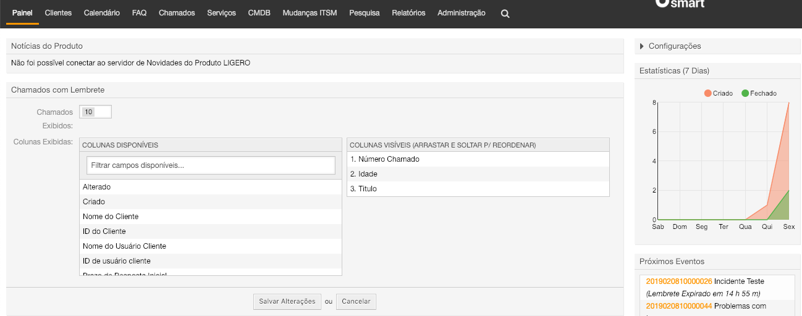
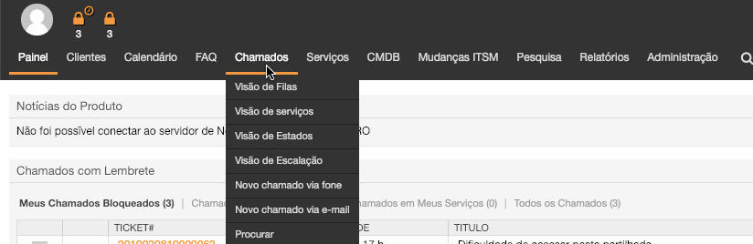
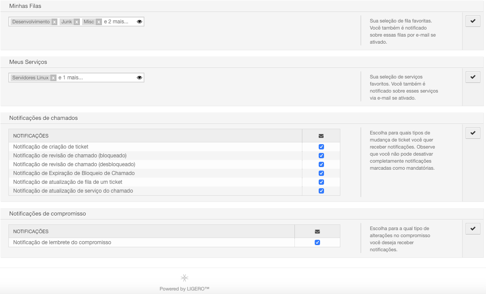

## Apresentação

A seguir descrevemos uma forma de operar este sistema. Trata-se apenas de uma sugestão de uso em relação a fucionalidades. O que nós da Complemento propomos, no entanto, é que a partir da livre experimentação de uso da ferramenta, sua equipe apropie-se e crie seu próprio "jeito de usar", aproveitando assim todo o potencial criativo que sua equipe pode ter em relação ao Ligero Smart;

## Fazendo login

A interface de atendente é acessada através do link:    [http://IP_DO_SERVIDOR/ligero/index.pl](http://IP_DO_SERVIDOR/ligero/index.pl)

Através deste link, será exibida uma tela onde o atendente deverá inserir o seu login e senha e clicar no botão "login".

## Conhecendo a interface de atendimento

### Painel de Controle 

No momento em que o atendente realiza o login no sistema, ele verá o Painel de Controle como página inicial:

Essa é a área onde o atendente tem a visão geral dos chamados e de suas atividades. Ela é composta por várias Widgets que podem ser habilitadas ou desabilitadas através do menu "Configurações" apontado na imagem anterior.

Veremos a seguir, as widgets padrão do OTRS.

#### Widgets de Listagem de Chamados 

__Chamados Novos:__ Chamados criados por e-mail ou pela interface de cliente que ainda não tiveram interação do atendente.

__Chamados Abertos:__ Chamados em andamento, ou seja, que já tiveram algum tipo de interação do atendente.

__Chamados com Lembrete:__ Nesta caixa aparecerá os chamados que atigirem a "data de pendência" especificada.

__Chamados Escalados:__ Chamados que já tiveram seu prazo de solução, atualização ou resposta excedidas.

__Chamados de Processos Executados:__ Chamados de processo em execução. Esta Widget mostra a etapa atual em que se encontra o chamado.

Podemos configurar cada uma destas caixas passando o mouse em cima da barra de título, clicando na engrenagem, e adicionando campos que acreditamos ser pertinentes para o nosso atendimento.

#### Widgets Adicionais 

__Visão geral de fila de chamado:__ Visualização de todos os chamados nas filas os quais o atendente tem permissão de leitura.

__Próximos eventos:__ Um widget que informa quais são os próximos chamados que irão escalar ou atingirão seu tempo de lembrete.

__Calendário de eventos de chamados:__ Nesta caixa, é possível efetuar e visualizar o agendamento do atendimento do chamado;

__Estatística:__ Um *dashboard* que mostra a quantidade de chamados criados e fechados nos últimos 7 dias;

__Online:__ Exibe atendentes e clientes que se encontram logados no sistema.

## Chamados 

Neste menu o atendente tem acesso à diferentes visualizações dos chamados, bem como criar novos chamados. Os principais submenus estão descritos abaixo.

## Visão de Filas 

Aqui o atendente tem a visualização de todas as filas para as quais ele presta atendimento ou onde possui permissão de visualização para consulta.

__Informações importantes:__

* O número entre parênteses indica a quantidade de chamados disponíveis naquela fila.  
* O link "Minhas Filas"mostra os chamados de todas as filas selecionadas pelo usuário no menu "Alterar Preferências Pessoais" (ver )  
* O link "Chamados disponíveis: X" que vem selecionado por padrão, mostra apenas aqueles chamados não bloqueados que estão na fila selecionada. X é o número de chaamados nesta situação.  
* O link "Todos os chamados: X" mostra além dos chamados disponíveis, todos os chamados ainda não encerrados desta fila, bloqueados (por você ou por outro atendente) e não bloqueados.  
* Os botões (link) S, M e L, situados a direita da tela, nos permitem escolher diferentes visualizações dos tickets desta fila. S (Small) nos mostra uma listagem mais resumida, com mais chamados por página. M (Medium) nos traz a visualização padrão, com algumas ações a partir da tela de listagem dos chamado.  
* Na visualização S (Small), podemos ordenar os chamados de diferentes maneiras, clicando no nome de uma das colunas disponíveis. Clicando novamente na mesma coluna, invertemos sua ordem de ascedente para descendente.
  
## Visão de Serviços 

Nesta tela o atendente tem a visão dos serviços de sua preferência e dos chamados existentes nesses serviços. Possíveis ser configuradas na tela "*Alterar Suas Preferências - Meus Serviços*". Veremos no próximos passos esse ajuste. 

Neste exemplo: Temos 1 chamado desbloqueado, um chamado de serviço "Servidor Linux", outro chamado do serviço "Servidores Windows". Os demais chamados estão bloqueados no "Meus Serviços" do atendente.

## Visão de Estado

Nesta tela o atendente tem a visão dos chamados por estados de ticket.

## Visão de Escalação

Nesta área o atendente visualiza os chamados que ultrapassaram o tempo limite acordados no SLA, bem como tem possibildade de visualizar os chamados que ultrapassarão estes tempos nos próximos dias.

### Novo Chamado via Fone

Quando um atendente recebe a ligação de um cliente, ele deve registrar este atendimento inserindo todos os dados do cliente necessários para dar continuidade ao atendimento da solicitação um Novo Chamado por telefone.

Abaixo temos a tela "Novo Chamado Via Fone" em sua configuração padrão. Comentaremos cada um dos pontos da mesma:

1. Tipo do chamado, podendo ser *Não Classificado*, *Incidente*, *Problema*, *Requisição*, etc.
2. Campo para pesquisar o cliente do chamado. A pesquisa é realizada enquanto se digita o nome ou e-mail do mesmo.
3. Cliente selecionado após a pesquisa (os dados do mesmo estão disponívies no item 16).
4. ID do Cliente. É definido automaticamente no momento que o cliente é selecionado.
5. Fila na qual o chamado será criado.
6. Serviço do chamado (Por padrão não é de seleção obrigatória).
7. SLA do chamado.
8. Propetário. No momento da crição do chamado, se deixarmos este campo em branco, o chamado permanecerá desbloqueado, ou seja, sem um atendente efetivamente designado para seu atendimento. Se quisermos, podemos preencher este campo neste momento e já determinar quem será o atendente designado para essa atividade.
9. Assunto do chamado.
10. Descrição da solicitação.
11. Aqui podemos anexar um ou mais arquivos, porém, por padrão, apenas um por vez.
12. Estado do chamado.
13. Data de Pendência. Data em que o chamado atingirá a pendência, caso seja selecionado um estado de tipo pendente ou pendente automático.
14. Impacto do Chamado.
15. Prioridade do Chamado. 
16. Tempo gasto na atividade.
17. Unidades de tempo
18. Informação do Cliente.
19. Criar 

### Novo Chamado via E-mail

Se desejar criar um chamado já solicitando ou enviando informações por e-mail ao cliente, este pode utilizar o menu "Novo Chamado Via E-mail" que permite, por exemplo, o envio de anexos para o e-mail do solicitante. 
A principal diferença entre esta tela e a tela "Novo Chamado Via Fone" é que a tela "Novo Chamado Via E-mail" possui dois campos adicionais para informar e-mails que serão colocados em cópia (item 1) ou cópia oculta (item 2):

__Procurar__ 

Possui uma interface onde é possível criar modelos de busca. Há a opção de utilizar filtros, como "estado", "tempo de criação do chamado", "Proprietário do chamado", "fila", e também defnir o tipo de saída: normal (em tela), impresso ou em arquivo csv.

__Exemplo:__ Neste caso estou filtrando todos os chamados da atendente Daniele Nakazone, saída normal. O resultado da minha pesquisa está abaixo.

### Pesquisas (tirar prints)

Há 4 tipos de buscas possíveis no Ligero Smart. São elas:

__Busca Completa__

Este tipo de pesquisa realiza uma busca por qualquer palavra que esteja no campo do chamado (Ex: o número do chamado).

__Busca por ID do Cliente__

Este tipo de pesquisa realiza uma busca por chamados de uma determinada empresa, através do ID.

__Busca por usuário do cliente__

Este tipo de pesquisa realiza uma busca por chamados de um determinado usuário de uma empresa.

__Lupa__

Possui uma interface onde é possível criar modelos de busca. Há  opção de utilizar filtros, como "estado", "tempo de criação do chamado", "atributos", e também definir o tipo de saída: em tela, impresso ou em arquivo csv.

## Alterando suas referências pessoais 

Por padrão o Ligero Smart exibe as configurações pré definidas pelo administrador para o recebimento de notificações dos chamados por e-mail que ingressam em suas filas, porém o atendente pode alterar a forma como receber essas notificações, e outras configurações, acessando a tela de preferências pessoais.

Para alterar suas preferências você deve clicar no ícone do usuário no canto superior esquerdo da tela do painel de controle.

__*Perfil Usuário*__

  

Clique em  *Perfil doUsuário*  

  

  

__Alterar Senha:__ ateração da senha do atendente atual.

__Avatar__ Alterar a imagem do seu avatar.

__Idioma:__ Alteração do idioma podendo selecionar qualquer um disponível.

__Fuso Horário__ Selecione seu fuso horário pessoal. Todos os horários serão exibidos conforme este fuso harário.

__Período Fora do Escritório:__ No caso de um atendente estiver de férias ou de licença essa opção pode ser habilitada colocando a data de Início e Fim. Essa opção pode ser configurada para exibir na tela dos demais atendentes, no __*Paínel de Controle - Configuração - Habilitar o campo Fora do Escritório.*__ Será exibido a seguinte tela: 

  

__DICA:__ Em instalações de grande porte, percebemos que a habilitação do recurso "Fora do Escritório" poderá deixar o sistema lento.

__*Configurações de Notificação*__

 

__Minhas Filas__  

O atendente poderá selecionar, dentre as filas que possui acesso,  as filas favoritas, que ele deseja receber notificações padrão, tais como criação do novo chamado, follow up etc.

__Meus Serviços__  

O atendente pode selecionar seu(s) Serviço(s) de trabalho na caixa "Meus Serviços". Isto permite a ele visualizar chamados de serviços específicos nas widgets do painel de controle, bem como receber notificações via e-mail (se ativado) baseadas em seus serviços. 

__Notificações__  

O atendente pode escolher para quais tipos de tickets deseja receber notificações. Não sendo possível desativar completamente notificações marcadas como mandatórias.  

__Notificações de compromisso__ 

Escolha para quais tipos de alterações de compromisso o atendente deseja receber notificações.

__*Outras Configurações*__

  
  

__Tema:__  Temos o tema Padrão, otros temas disponíveis são: Alto Contraste, Marfim, Marfim(fino),Padrão(fino). Selecione o seu preferido para o software.

__Tempo e Atualização do Painel:__ Se habilitado, os diferentes quadros (Painel, Visão de Estados, Visão de Filas) serão automaticamente atualizados após o temp especificado.

__Tela Após Novo Chamado:__ Define qual tela o atendente verá após cria um chamado nas telas Novo Chamado Fone ou E-mail. A opção Criar Ticket irá fazer com que o Ligero Smart mostre uma nova criação de um chamado, enquanto a opção Zoom do Chamado fará com que o sistema encaminhe o atendente para a tela de visualização do chamado recem criado. 

__Tela Após Criar Ordem de Serviço:__ Após criar uma ordem de serviço podemos configurar qual tela deve ser exibida após a criação da ordem de serviço. Sendo elas "__ChangeZoom__", "__Ordem de Serviço__".

## Utilizando a Ferramenta 

__Acessando os chamados__

Existem algumas formas de se acessar um novo chamado no sistema. Quando o mesmo é criado por um cliente (solicitante), o Ligero Smart notifica automaticamente os atendentes da fila responsável por e-mail, enviando uma mensagem que contém um link direto para o chamado. Basta clicar neste link para acessar o chamado em questão. 

Ao clicar no link enviado para o e-mail, o atendente será direcionado para a tela com as ações possíveis de serem realizadas neste chamado.

A partir dessa área o atendente deve iniciar a interação com o chamado seguindo os passos descritos adiante.

__Primeiro Tratamento do Chamado - Bloquear o chamado__

A primeira ação que o analista do Service Desk deve realizar num novo chamado é blquear o chamado para sí.

Quando o atendente clica em "*Bloquear*", ele passa a ser o proprietário do chamado, tendo a obrigação de conduzir a solução da solicitação.

Esta opção permite que os chamados não sejam respondidos em duplicidade causando confusão no atendimento.

__Interagindo com o cliente (solicitante) por telefone ou e-mail__

Após o bloqueio do chamado, daremos início ao atendimento com o cliente por telefone ou e-mail.

__Interação por telefone__

Caso façamos um contato por telefone com o cliente, clicamos em "Comunicação -> Chamada Telefônica Realizada" e o sistema abrirá uma janela para inserirmos as informações deste contato.

Conforme se desenvolve nosso contato telefônico com o cliente, registramos a conversa adiocionando informações que facilitem as próximas etapas de atendimento.

Veja que é possível trabalharmos inclusive com respostas pré-definidas para agilizar o trabalho do atendente.
Na opção "Próximo Estado do Chamado" selecionamos a opção correspondente as alterações atuais se desejarmos mudar seu estado. 
Concluímos essa etapa clicando em enviar.

__Interação por e-mail__

Para darmos continuidade ao atendimento entrando em contato por e-mail com o cliente, basta clicar em "__Responder__" e escolher um dos templates (modelos) possíveis de resposta na tela de detalhamento do chamado. 
Uma nova janela contendo o template de resposta escolhido se abrirá.
Nessa tela podemos inserir todas informações que julgamos necessárias para prestar o atendimento e enviar ao cliente, preencher o campo "Texto".

Na opção "Próximo Estado do Chamado" selecionamos a opção correspondente as alerações atuais se desejarmos mudar seu estado.

Concluímos essa estapa clicando em enviar.

