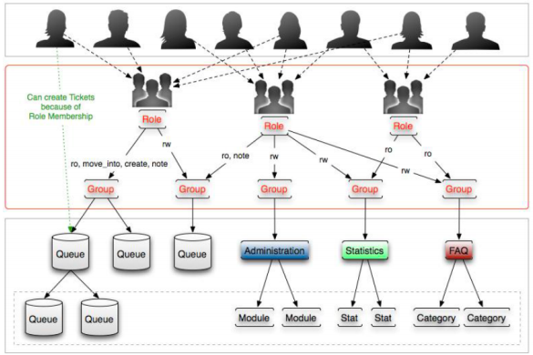

## Licenciamento deste Manual/Documento 

### Atribuição - Compartilhamento pela mesma Licença (by-sa)

Esta licença permite que outros remixem, adaptem, e criem obras derivadas ainda que para fins comerciais, contanto que o crédito seja atribuído ao autor e que essas obras sejam licenciadas sob os mesmos termos. Esta licença é geralmente comparada a licença de software livre. Todas as obras derivadas devem ser licenciadas sob os mesmos termos desta. Dessa forma, as obras derivads também poderão ser usadas para fins comerciais.

O trabalho Manual???

## Usuários, grupos e papéis.

O ligero Smart possui um sistema de autenticação de usuários beseada em grupos de permissão e papéis. Este sistema pode ser integrado com ferramentas externas de autenticação tal como Active Directory.

Primeiramente, temos que entender a diferença entre grupos e papéis.

__Grupos__, dentro do ligero Smart, são entidades associadas a filas e funcionalidades em geral. Por exemplo, se um atendente quer ter permissão de criar um chamado na fila "Central de Serviços", ele deverá possuir permissão RW ou Create no grupo associado a esta fila, que pode ser chamar, por exemplo, "g_central_serviços".

Se um atendente quer ter permissão para criar um relatório, ele deve ter permissão RW no grupo "stats" (grupo padrão do Ligero Smart para relatórios).

Já os papéis devem ser utilizados para intermediar o acesso dos atendentes aos grupos, organizando e facilitando a gestão de usuários. Sendo assim, o diagrama proposto para esta gestão é o seguinte: 

__Atendente <-> Papéis <-> Grupos <-> Filas e funcionalidades:__

Desta maneira, recomendamos que seja desativado o recurso *Atendentes <-> Grupos do Sistema*. Para fazer isto, acesse "Admin"-> "Configurações do Sistema"-> "Framework"-> "Frontend::Admin::ModuleRegistration". Desmarque o parametro "Frontend::Module###AdminUserGroup".

Uma vez desativada esta opção, o menu *Atendentes <-> Grupo* não fica mais disponível, e a tela exibida após a criação de um atendente é a tela de associação do atendente com os papéis disponíveis no sistema, e não mais a da associação com grupos.

Exemplos de Papéis que podemos criar:

1. Atendente do Nível 1
2. Gestor
3. Administrador do Ligero Smart
   
__*As permissões do Sistema*__

Para dar permissão de acesso a filas e recursos no sistema é necessário então criar __papéis__ e associá-los à __grupos__. Para criar Papéis, acesse *Admin -> Papéis.*

Depois de criar um papel, para associá-lo a um grupo, acesse *Admin -> Papéis <-> Grupos*

Será necessário prencher a matriz abaixo:

img

Nesta tela definimos quais as permissões serão concedidas aos atendentes que tiverem este Papel no sistema. Entenda cada uma das permissões possíveis:

__RO-__ Permissão de leitura na fila, ou no recurso associado ao grupo.

__MOVE_INTO-__ Permite aos atendentes de um papel mover chamados para as filas associadas ao grupo.

__CREATE-__ Permite aos atendentes de um papel criar chamados em filas que estão associadas ao grupo.

__NOTE-__ Permite aos atendentes de um papel adicionar anotações em chamados que estão nas filas associadas ao grupo.

__OWNER-__ Permite aos atendentes de um papel se tornarem proprietários de chamados que estão nas filas associadas ao grupo.

__PRIORITY-__ Permite aos atendentes de um papel alterar a prioridade de chamados que estão nas filas associadas ao grupo.

__RW-__ Permissão total na fila ou no recurso.

Vamos imaginar que temos duas filas no sistema sendo elas "Nível 1" e "Desenvolvimento".

Teremos então dois tipos de colaboradores (papéis) utilizando o sistema: "Atendente de Primeiro Nível" e "Desenvolvedor".

Os atendentes de primeiro nível terão permissão total na fila Nível 1, mas poderão apenas mover, visualizar e criar chamados na fila "Desenvolvimento".

Os Desenvolvedores poderão, por sua vez, mover chamados de volta para a fila Nível 1, mas não poderão criar ou visualizar chamados na fila Nível 1.

A fila Nível 1 está associada com um grupo de nome "nível_1" e a fila Desenvolvimento está associada com um grupo de nome "desenvolvimento".

As permissões do papel Atendente de Nível 1 ficaram assim:

img

As permissões dopapel Desenvolvedor ficariam assim:

img

Reparem que abos os casos, selecionamos o grupo users. O grupo users é um grupo padrão do Ligero Smart. Ele dá acesso ao atendente criar e alterar clientes e empresas no sistema.

__*Criação de Grupos e Papeis pela Linha de Comando*__

Uma maneira de facilitar a gestão do sistema e criar dados em massa, é utilizando o Ligero.console.pl
Este utilitário permite realizar gestão e manutenção de grupos, papeis, filas e outros recursos do sistema. 

__Criação de Grupos__
Para criar grupos a partir da linha de comando, utilize o código abaixo, substituindo grp_service_desk pelo nome do grupo que se deseja criar:
/opt/ligero/bin/ligero.Console.pl Admin::Group::Add --name"grp_service_desk" -allow-root

__Criação de Papeis__
Para criar grupos a partir da linha de comando, utiliza o código abaixo, substituindo grp_service_desk pelo nome do grupo que deseja criar:
/opt/ligero/bin/ligero.Console.pl Admin::Role::Add --nameÄnalista de Service Desk"--allow-root

